class: center, middle

.title[MCViNE]
&nbsp;  
.subtitle[Realistic neutron experiment simulations]
&nbsp;
.center[[{mcvine.org}](http://mcvine.org)]
&nbsp;              
&nbsp;              
&nbsp;              
&nbsp;              
&nbsp;              
.author[Jiao Lin] 
<!--.center[[linjiao.info](http://linjiao.info)]-->
&nbsp;              
.institution[Neutron Data Sciences Group]
&nbsp;  
.institution[Oak Ridge National Lab]
&nbsp;              
.date[Oct 19, 2018]

        
.footnote[Created with [{Remark.js}](http://remarkjs.com/) using [{Markdown}](https://daringfireball.net/projects/markdown/) +  [{katex}](https://github.com/Khan/KaTeX/)]


---

# Overview

1. Introduction

--

2. Examples 
   * New instruments
     * Inelastic: direct geometry spectrometers
     * Elastic: engineering diffractometers
   * Sample environments
   * Resolution functions for DGS experiments
     * Powder
     * Single crystal
.hidden[* Super resolution phonon Density of States]

--

3. Usage
   * of ready-to-use virtual instruments (Direct Geometry Spectrometers)
   * instrument design and optimization


---

# Introduction

* MCViNE: Monte Carlo **VIrtual Neutron Experiment**

* Monte Carlo neutron ray-tracing simulation software
  - modeling of systems of **hierachical** structures

* Python/C++

???

* MCViNE is a Monte Carlo neutron ray-tracing software package written in C++,
and wrapped in Python.
* The key feature of MCViNE is that it is intended for realistic simulation 
of experiments, not just the instrument itself.
* We will talk about this in more details, but I want to mention here that 
mcvine models the neutron components in a hierarchical way, which allows for
flexible and powerful simulations.

--

* Website: http://mcvine.org

--

* Development portal: http://github.com/mcvine/devel


---

# Linear pipeline structure in Monte Carlo neutron ray-tracing packages

* Adopted by McStas, Vitess, IDEAS, etc

.center[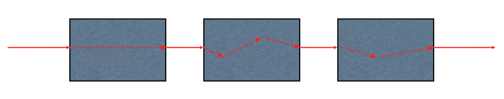]

???
In the late 1990s and early 2000s.

---

# MCViNE: Support **hierarchical** structure

* Multiple scattering

.center[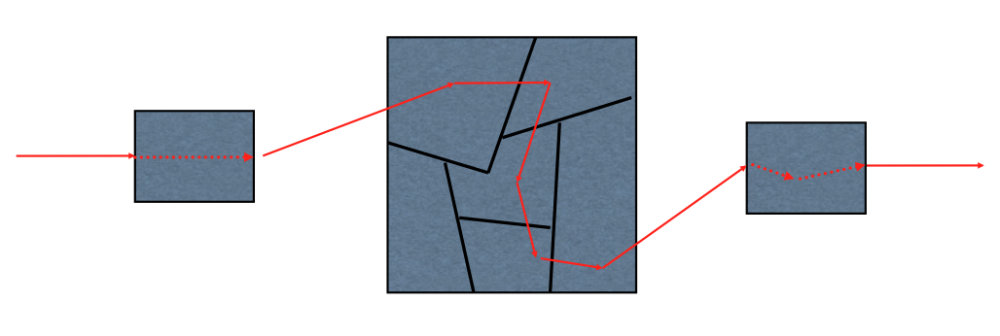]

---

# MCViNE: Support **hierarchical** structure

* Sample assembly
  * consists of multiple "neutron-scatterers"

.center[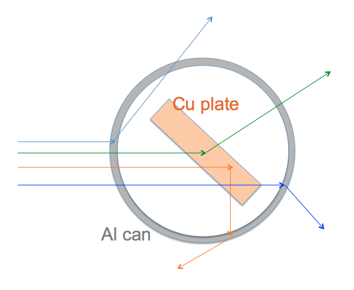]


---

# MCViNE: Support **hierarchical** structure

* Neutron scatterer
  * shape and scattering kernels

.center[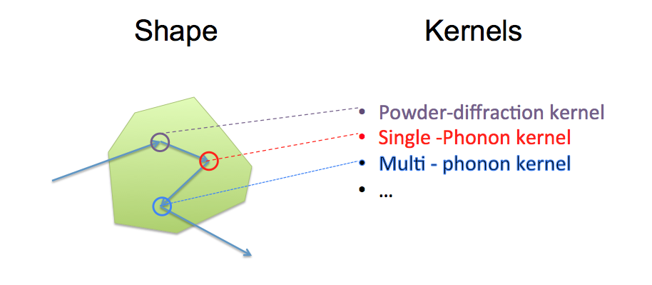]

???
* Should add a slide for Constructive Solid Geometery

---

# MCViNE: Support **hierarchical** structure -- sample

.center[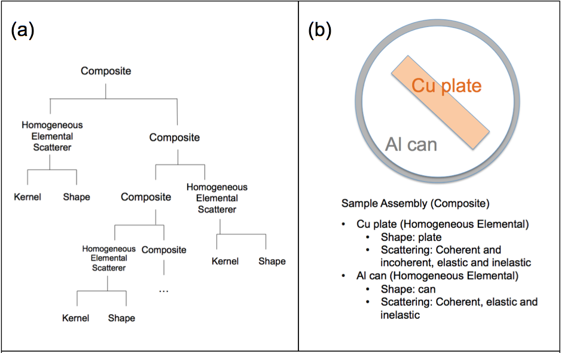]


---

# MCViNE: Support **hierarchical** structure -- detector system

.center[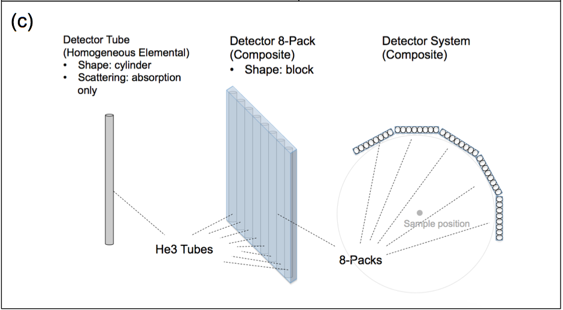]

---
# MCViNE: Support **hierarchical** structure

Publication: [Lin J.Y.Y et al., MCViNE – An object oriented Monte Carlo neutron ray tracing simulation package](http://dx.doi.org/10.1016/j.nima.2015.11.118)


* Complex samples and detector systems

---

# Examples

   * New instruments
     * Inelastic: direct geometry spectrometers
     * Elastic: engineering diffractometers
     
   * Sample environments
   * Resolution functions for DGS experiments
     * Powder
     * Single crystal

.hidden[* Super resolution phonon Density of States]


---
class: split-50

# Example 1: CHESS instrument at STS


.left-column[
CHESS
* A Time-of-Flight chopper spectrometer at STS
* Better brightness suitable for small samples
* Detector system with tremendous solid-angle coverage

.center[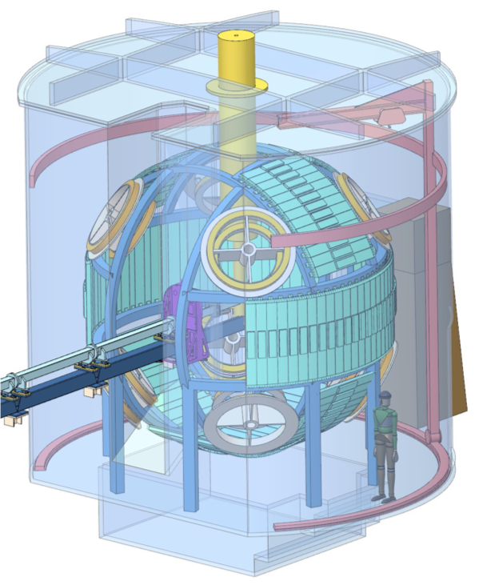]
]

.right-column[
.center[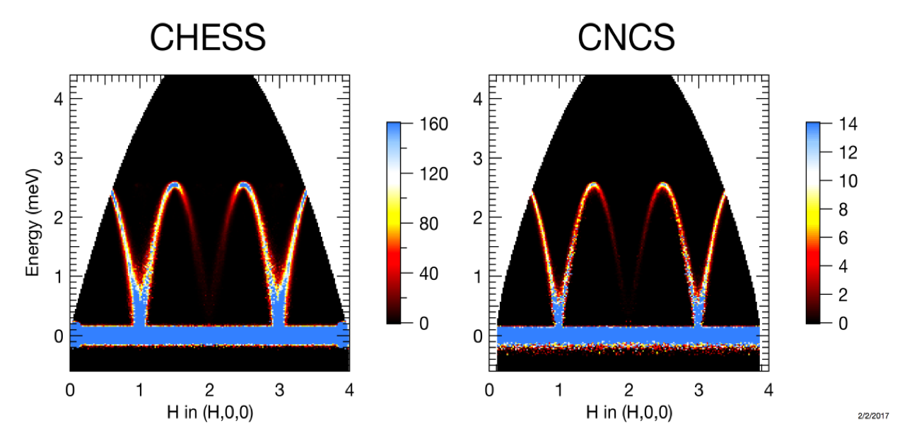]
MCViNE simulations
* Realistic Monte Carlo simulations tracking neutrons from start to end
* Performance of the moderator, guides, sample and detector system are considered
* Simulated data reduced by Mantid
]

.reference[
[Sala G. et al., Conceptual design of CHESS, a new direct‐geometry inelastic neutron spectrometer dedicated to studying small samples](https://doi.org/10.1107/S1600576718002224)
]

---
# Simulation platform

* https://jupyter.sns.gov

--
* jupyter: a web based computing environment
* notebook: supports computation, visualization, comments
* jupyter.sns.gov: a service closely coupled with SNS analysis clusters

--
* MCViNE tutorials exist as jupyter notebooks

.center[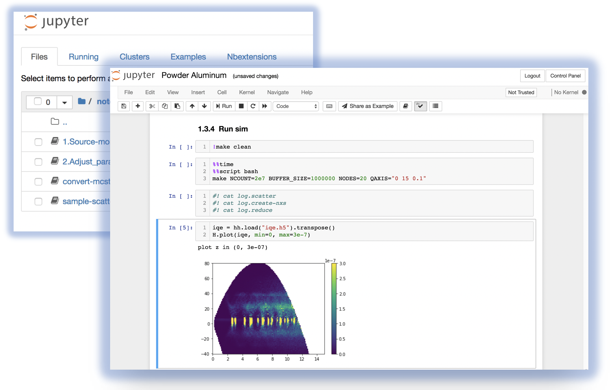]

---
# Typical simulation procedure

* Simulate incident beam using MCViNE or McStas
--
class: split-60

.right-column[
Energy spectrum

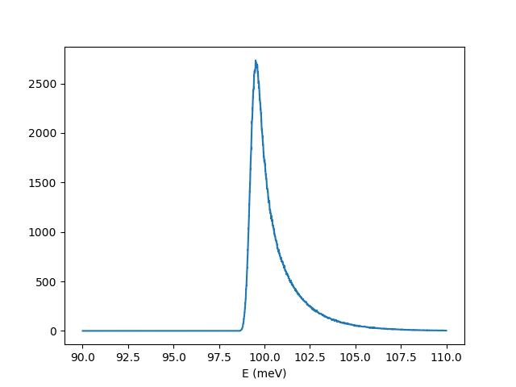

Cross section

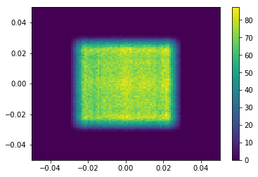
]

.left-column[
Beam monitors

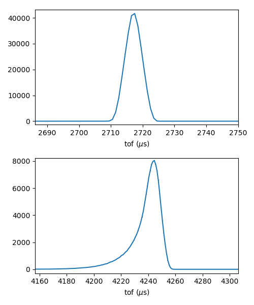
]

---
# Typical simulation procedure

* Simulate incident beam using MCViNE or McStas
* ** Sample scattering simulation **

.center[]

---
# Typical simulation procedure

* Simulate incident beam using MCViNE or McStas
* ** Sample scattering simulation ** -- sample specification

```yaml
name: KVO
excitation:
  type: spinwave
  E_Q: 2.563*sqrt(1-(cos(h*pi)*cos(k*pi))**2)
  S_Q: 1
  Emax: 3
orientation:
  u: 1, 0, 0
  v: 0, 1, 0
packing_factor: 1.0
temperature: 300*K
shape: block width="4.6*cm" height="4.6*cm" thickness="2.3/4*cm"
chemical_formula: K2V3O8
lattice:
  constants: 8.87, 8.87, 5.2, 90, 90, 90
  basis_vectors:
    - 8.87, 0, 0
    - 0, 8.87, 0
    - 0, 0, 5.2
```

???
* CIF support
* shape
* kernelp


[//]: # (sample yaml and spinwave)

---
class: split-60
# Typical simulation procedure

* Simulate incident beam using MCViNE or McStas
* ** Sample scattering simulation ** -- sample specification

.left-column[
```yaml
name: KVO
excitation:
  type: spinwave
  E_Q: 2.563*sqrt(1-(cos(h*pi)*cos(k*pi))**2)
  S_Q: 1
  Emax: 3
orientation:
  u: 1, 0, 0
  v: 0, 1, 0
packing_factor: 1.0
temperature: 300*K
shape: block width="4.6*cm" height="4.6*cm" thickness="2.3/4*cm"
chemical_formula: K2V3O8
lattice:
  constants: 8.87, 8.87, 5.2, 90, 90, 90
  basis_vectors:
    - 8.87, 0, 0
    - 0, 8.87, 0
    - 0, 0, 5.2
```
]

.right-column[
.center[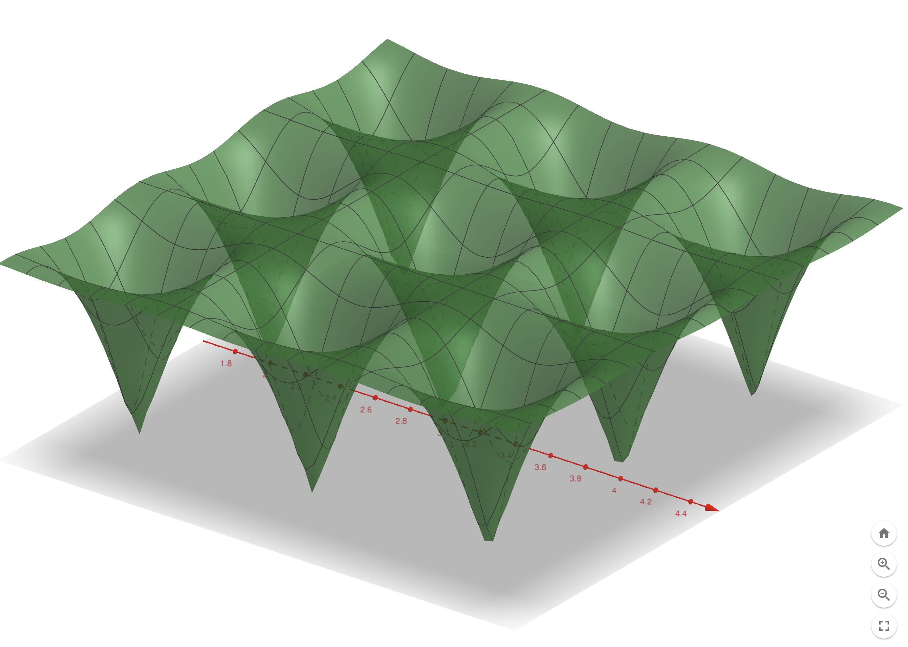]
]


[//]: # (sample yaml and cif)

---
# Typical simulation procedure

* Simulate incident beam using MCViNE or McStas
* ** Sample scattering simulation ** -- sample specification

```yaml
name: KVO
excitation:
  type: spinwave
  E_Q: 2.563*sqrt(1-(cos(h*pi)*cos(k*pi))**2)
  S_Q: 1
  Emax: 3
orientation:
  u: 1, 0, 0
  v: 0, 1, 0
packing_factor: 1.0
temperature: 300*K
shape: block width="4.6*cm" height="4.6*cm" thickness="2.3/4*cm"
structure_file: KVO.cif
```


[//]: # (sample yaml and hollow cylinder)

---
class: split-60
# Typical simulation procedure

* Simulate incident beam using MCViNE or McStas
* ** Sample scattering simulation ** -- sample specification

.left-column[
```yaml
name: KVO
excitation:
  type: spinwave
  E_Q: 2.563*sqrt(1-(cos(h*pi)*cos(k*pi))**2)
  S_Q: 1
  Emax: 3
orientation:
  u: 1, 0, 0
  v: 0, 1, 0
packing_factor: 1.0
temperature: 300*K
structure_file: KVO.cif
shape:
  difference:
    - cylinder:
        radius: 12*mm
        height: 10*cm
    - cylinder:
        radius: 11*mm
        height: 11*cm
```
]

.right-column[
.center[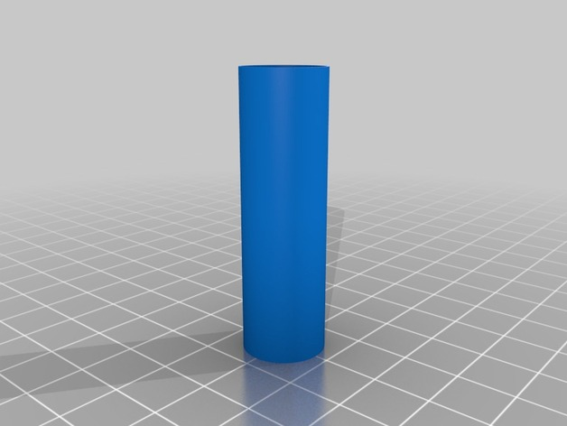]
]


???
code to convert sample yaml file to xml files for DGS
```
    from mcvine.workflow.sample import loadSampleYml, dgs_setEi
    sample = loadSampleYml(sample_yaml)
    dgs_setEi(sample, Ei)
    from mcvine.workflow.sampleassembly.scaffolding import createSampleAssembly
    createSampleAssembly(sa_dir, sample)
```

---
# Typical simulation procedure

* Simulate incident beam using MCViNE or McStas
* Sample scattering simulation
* ** Detector system simulation ** -- generate NeXus files -- reduce by Mantid
--
.center[]  

---
class: split-50

# Typical simulation procedure

* Simulate incident beam using MCViNE or McStas
* Sample scattering simulation
* ** Detector system simulation ** -- generate NeXus files -- reduce by Mantid
  - Detector system specification in Mantid can be converted into MCViNE
    by [mantid2mcvine](https://github.com/mcvine/mantid2mcvine)

.left-column[
.center[]
]

.right-column[
&nbsp;
.center[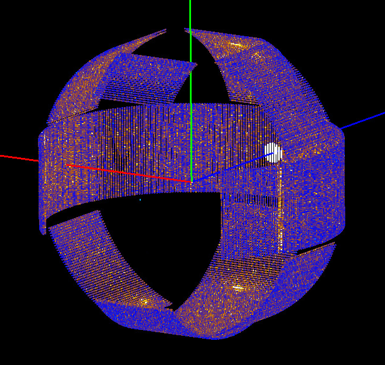]
]


[//]: # (IDF-header)

---

# Typical simulation procedure

* Simulate incident beam using MCViNE or McStas
* Sample scattering simulation
* ** Detector system simulation ** -- generate NeXus files -- reduce by Mantid
  - Detector system specification in Mantid can be converted into MCViNE
    by [mantid2mcvine](https://github.com/mcvine/mantid2mcvine)
      - ** Mantid instrument definition IDF file **

.center[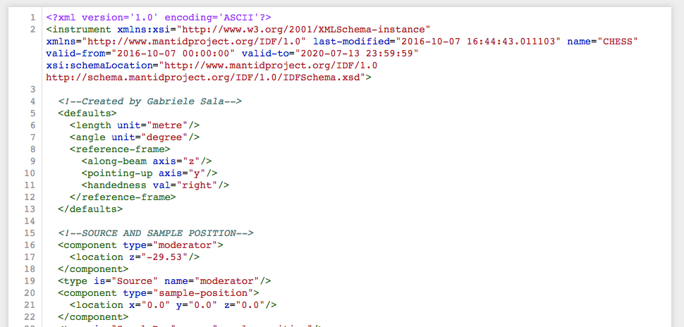]


[//]: # (IDF-pack)

---

# Typical simulation procedure

* Simulate incident beam using MCViNE or McStas
* Sample scattering simulation
* ** Detector system simulation ** -- generate NeXus files -- reduce by Mantid
  - Detector system specification in Mantid can be converted into MCViNE
    by [mantid2mcvine](https://github.com/mcvine/mantid2mcvine)
      - ** Mantid instrument definition IDF file **

.center[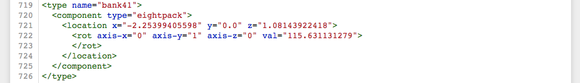]


[//]: # (CHESS-debug)

---
class: split-50

# Typical simulation procedure - debugging

* Simulate incident beam using MCViNE or McStas
* Sample scattering simulation
* Detector system simulation

.left-column[.center[
Cones

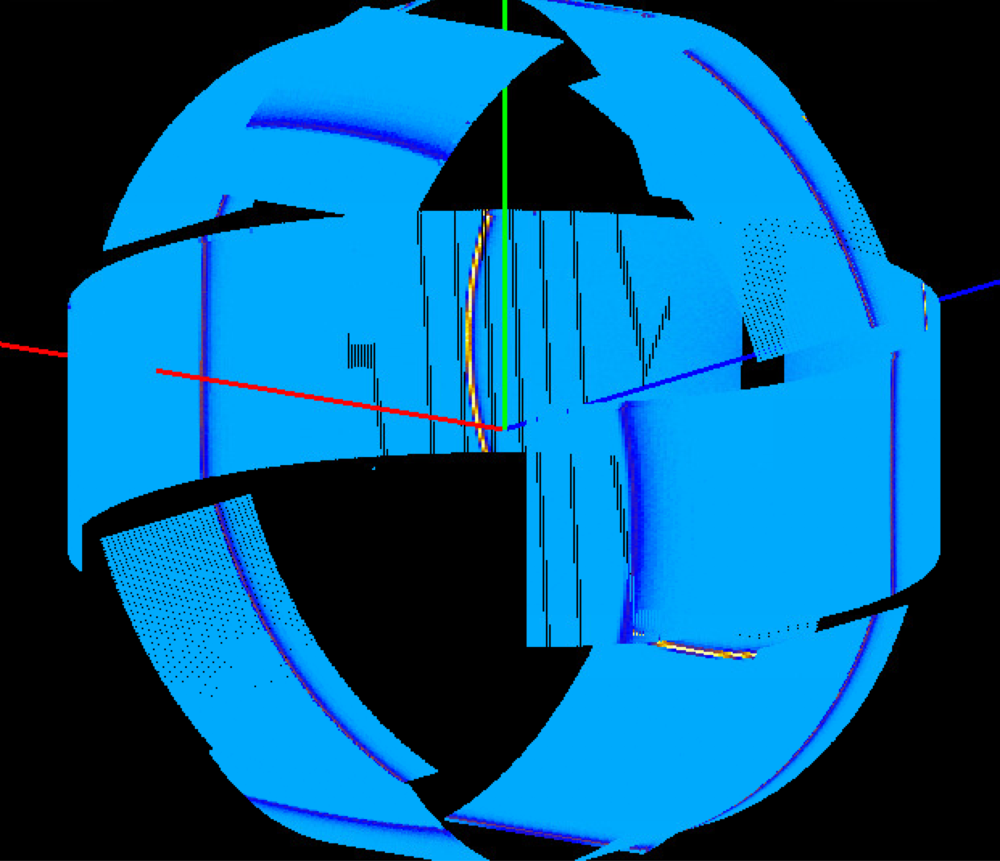
]]
.right-column[.center[
Vanadium plate

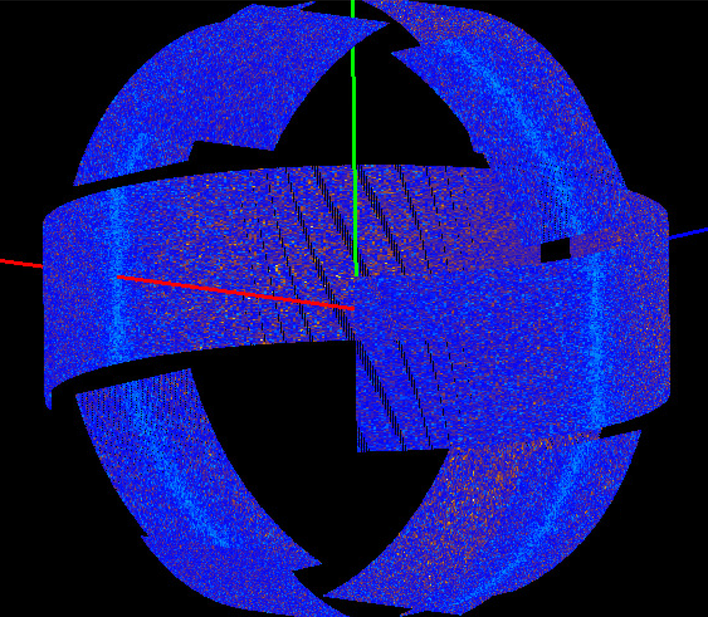
]]


---
# Typical simulation procedure

* Simulate incident beam using MCViNE or McStas
* Sample scattering simulation
* ** Detector system simulation ** -- generate NeXus files -- reduce by Mantid

.center[]

???
Kernels
* spin-wave kernel
* incoherent elastic line


---
# More DGS examples

See http://mcvine.org/examples.html

---
class: split-50

# Example 2: MENUS instrument at STS

"MENUS at the STS will be a transformational high flux versatile multi-scale and multi-modal materials 
engineering beamline with unprecedented new capabilities."

.left-column[
.center[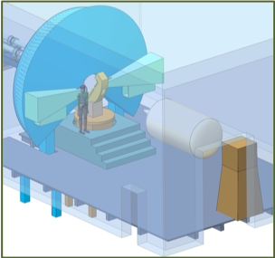]
]

.right-column[
.center[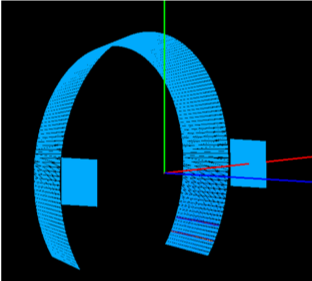]
]

---
class: split-50
# Example 2: MENUS instrument at STS

* Ni3Al
* Kernel: powder diffraction
* MENUS boosts intensities at long-wavelengths

.left-column[
.center[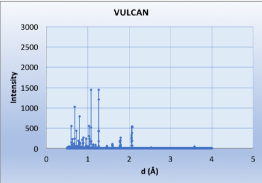]
]

.right-column[
.center[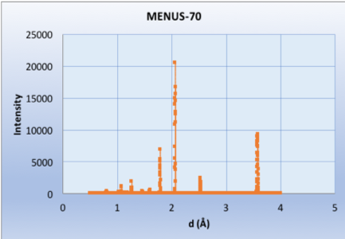]
]

???
* high flux, wide Q coverage
* strain/phase-transition/texture evolution in 3 orthogonal axes
* Ni3Al diffraction peaks: https://jupyter.sns.gov/user/lj7/notebooks/simulations/MENUS/sample-fccNi/create.ipynb

---
class: split-50
# Example 2: MENUS instrument at STS

* Ni3Al
* Kernel: powder diffraction
* MENUS high resolution mode good for resolving superlattice peaks

.left-column[
.center[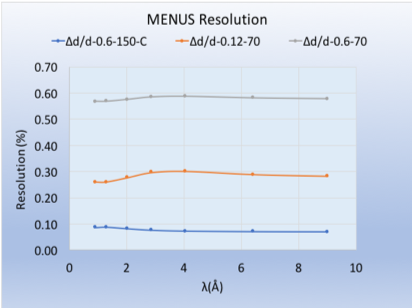]
]

.right-column[
.center[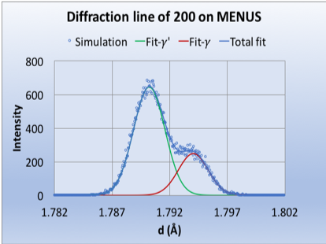]
]

---
# Sample environments

.center[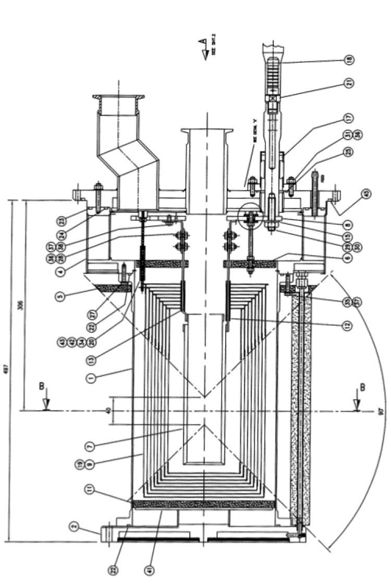]

* Multiple scattering

---
# Multiple scattering

.center[]

---
# Multiple scattering - MICAS furnace

.center[]

???
# Multiple scattering - MICAS furnace

.center[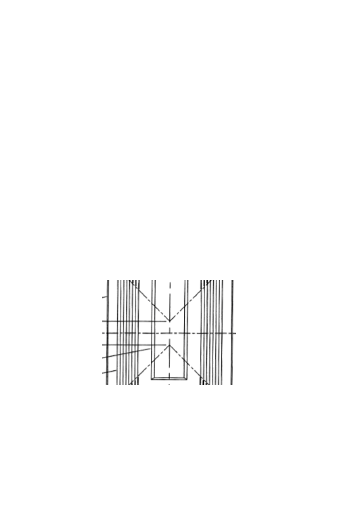]


---
# Multiple scattering - MICAS furnace

.center[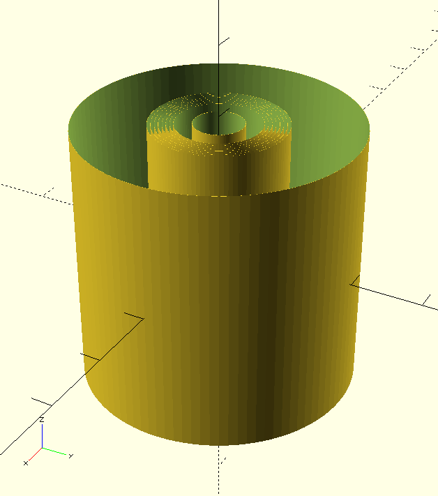]

---
class: split-60
# Multiple scattering - MICAS furnace

.left-column[
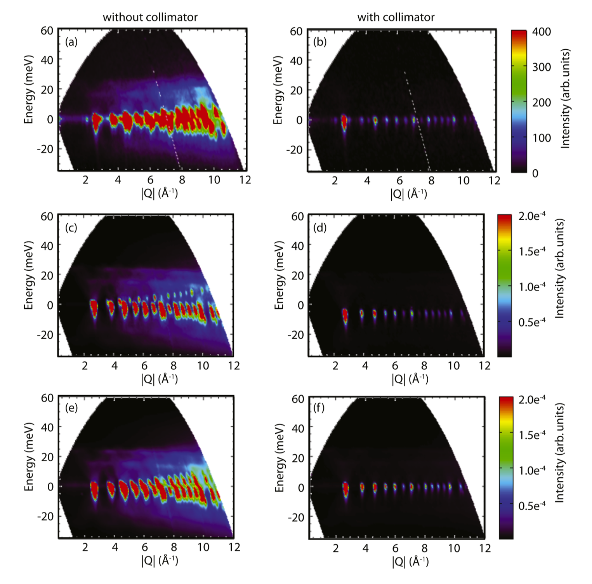
]

.right-column[

* Top: experimental 
* Middle: simulation without multiple-scattering (MS)
* Bottom: simulation with MS

&nbsp;

&nbsp;

&nbsp;

&nbsp;


* Left: without collimator
* Right: with collimator
]


.reference[
[Niedziela J.L. et al., Design and operating characteristic of a vacuum furnace for time-of-flight inelastic neutron scattering measurements](https://doi.org/10.1063/1.5007089)
]

---
# Examples

   * New instruments
     * Inelastic: direct geometry spectrometers
     * Elastic: engineering diffractometers
   * Sample environments
     
   * **Resolution functions for DGS experiments**
     * Powder
     * Single crystal
.hidden[* Super resolution phonon Density of States]

???
# Resolution - \\(^4 \mathrm{He}\\) measurement at ARCS


---
# Resolution for Direct Geometry Spectrometers - Powder

--
class: split-60

.right-column[
Energy spectrum


Cross section


]

.left-column[
Beam monitors


]


---
# Resolution for Direct Geometry Spectrometers - Powder

Ikeda Carpenter function

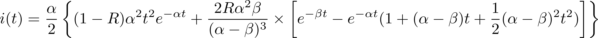

Gaussian-broadend Ikeda-Carpenter function

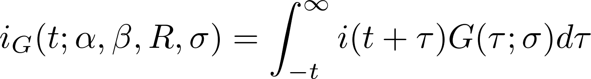

--

Resolution function is asymmetric and depends on energy transfer

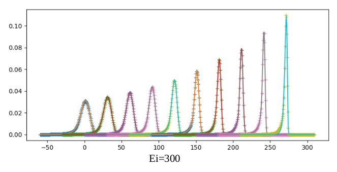


---
class: split-50
# Resolution for Direct Geometry Spectrometers - Powder

.left-column[
Inputs
* simulated beam
* sample
* point of interestes: \\(Q\\), \\(E\\)
* settings of \\(Q\\), \\(E\\) axes
]

.right-column[
.center[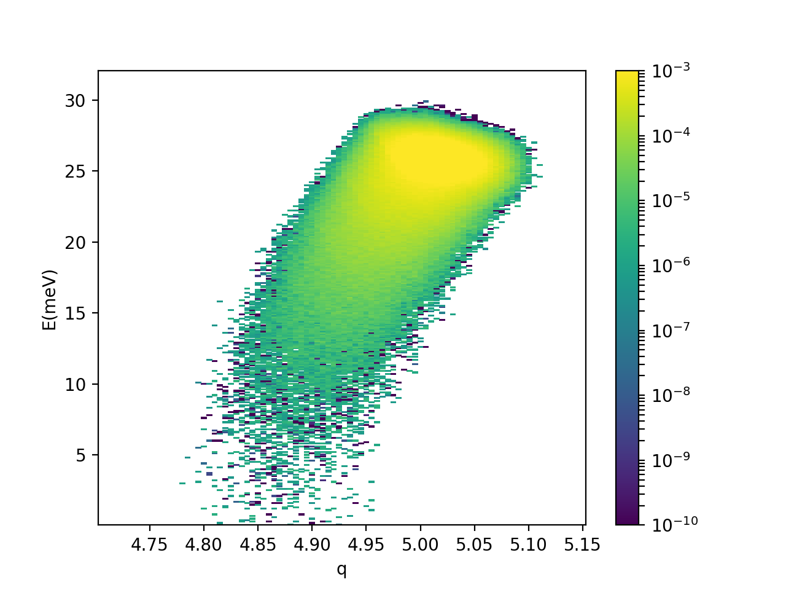]
]

---
# Resolution for Direct Geometry Spectrometers - Single crystal

.center[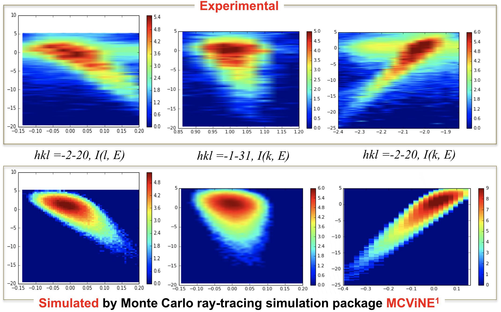]

---
# Resolution for Direct Geometry Spectrometers - Single crystal

.center[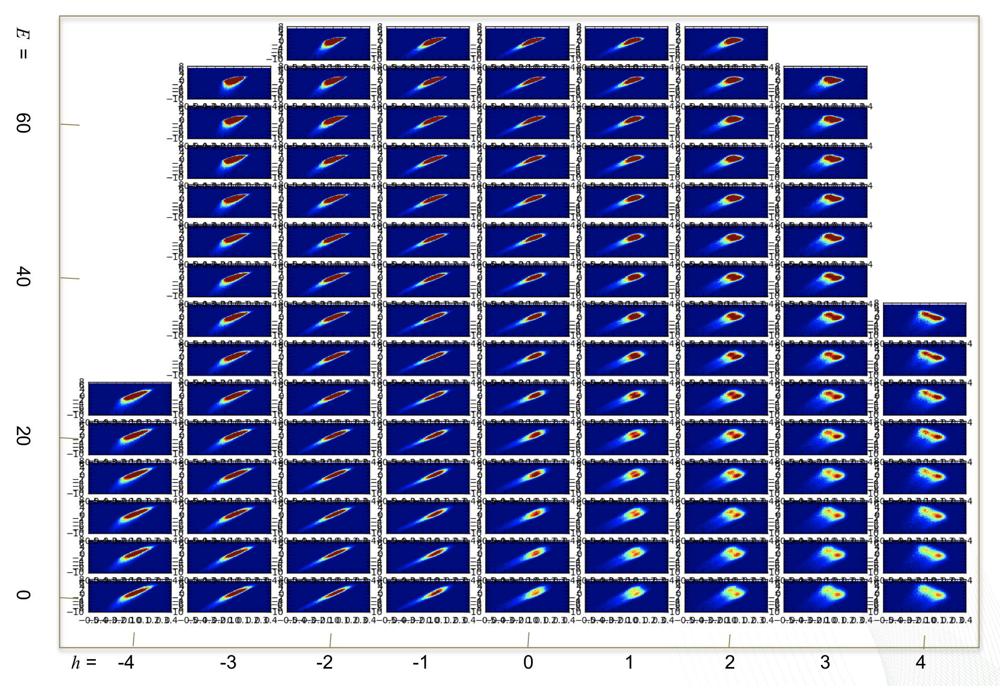]

---

class: split-50
# Resolution for Direct Geometry Spectrometers - Single crystal


.left-column[
Inputs

* simulated beam
* sample
  - material
  - shape
  - orientation
  - \\(\psi\\) scan
* slice info
  - point of interest
  - slice direction
]

.right-column[
.center[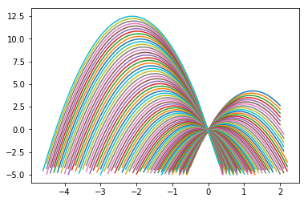]
]

???
.center[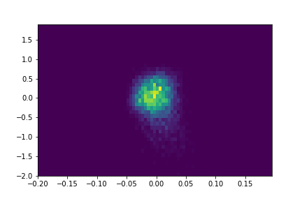]

---
# Usage

   * of ready-to-use virtual instruments (Direct Geometry Spectrometers)
   * instrument design and optimization

---
# Usage of ready-to-use virtual instruments (Direct Geometry Spectrometers)

Start from here: http://mcvine.org/usage.html

---
# Usage: instrument design and optimization

Start from here: https://jupyter.sns.gov/user/{UID}/tree/notebooks/mcvine/instrument_simulation

---
# Links

* Homepage: http://mcvine.org

* Slack: https://mcvine.slack.com
  - [Join](https://join.slack.com/t/mcvine/shared_invite/enQtMzY0NDk5NjEwNTY0LTRiMDQ3Y2E2YzA3MGYzYTM3MzcwOTBkZjc0MzA5ODJlYWZhOTQyYWVhZGJkZjYyYmViODhkN2RkN2EwMjM4MDU)

* Notebooks
  - [Instrument simulation at jupyter.sns.gov](https://jupyter.sns.gov/user/{UID}/tree/notebooks/mcvine/instrument_simulation)
  - [DGS virtual experiments at jupyter.sns.gov](https://jupyter.sns.gov/user/lj7/notebooks/notebooks/mcvine/jui/1%20-%20DGS.ipynb)
  - [DGS resolution calculation at jupyter.sns.gov](https://jupyter.sns.gov/user/lj7/notebooks/notebooks/mcvine/resolution/DGS-powder.ipynb)

* Development: https://github.com/mcvine/devel


---
class: split-50

# Acknowledgements

.left-column[
## Collaborators
* SNS
  * Garrett Granroth
  * Gabriele Sala
  * Fahima Islam
  * Doug Abernathy
  * Matt Stone
  * Barry Winn
  * Ke An
* Caltech
  * Brent Fultz
  * Hillary Smith
  * Dennis Kim
]

.right-column[
## Developers
* Ian Lumsden
* Li Li
* Alta Fang
* Alex Dementsov
]

